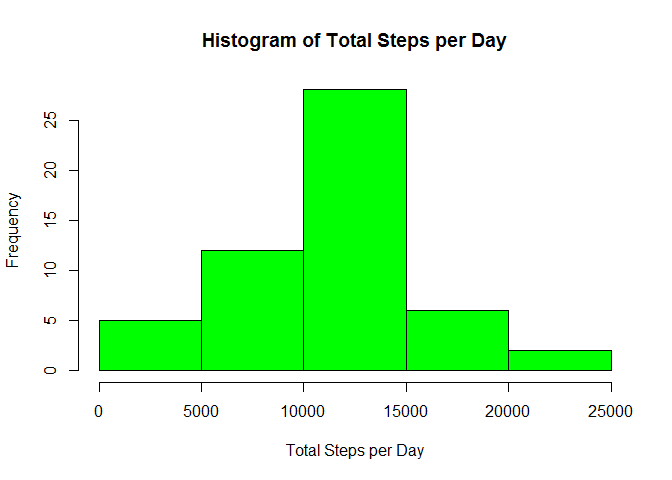
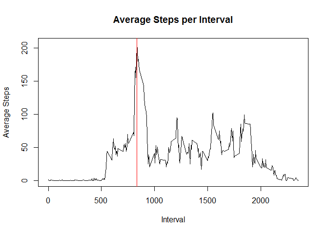
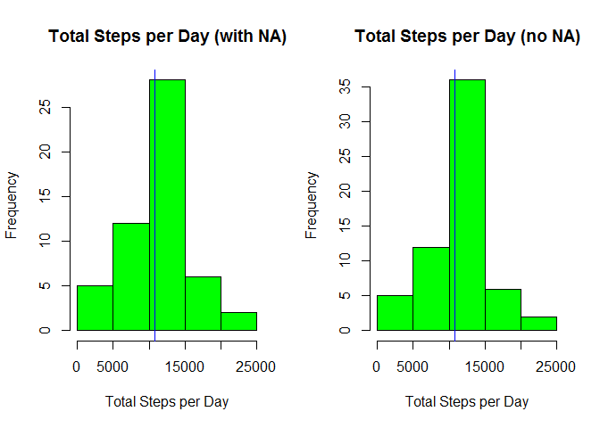
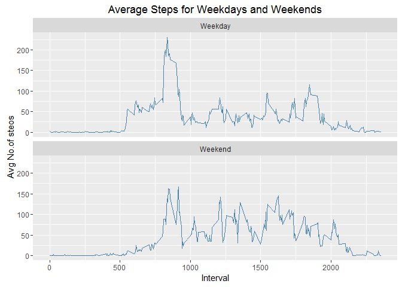

# Reproducible Research: Peer Assessment 1


## Loading and Preprocessing the data

The data is loaded from `activity.csv` (which is assumed to be available in the working directory in R) and is stored in the `activity` data frame.

Additionally, the `date` column for the resulting `activity` data frame was converted from factor to Date.


```r
activity <- read.csv("activity.csv", header = TRUE)
activity$date <- as.Date(activity$date, format = "%Y-%m-%d")
```

## What is mean total number of steps taken per day?

To answer this question, we need to aggregate the data in `activity`. This is done using the `group_by()` function in `dplyr` library. 


```r
library(dplyr, warn.conflicts=FALSE)

byDay <- group_by(activity, date) %>% summarize(sum(steps))
names(byDay) <- c("date", "totalSteps")
```

Now that the total steps taken per day has been calculated, we can now plot it.


```r
par(mfrow=c(1,1))
hist(byDay$totalSteps, xlab="Total Steps per Day",
     main = "Histogram of Total Steps per Day", col="green")
```

<!-- -->

We can also calculate the mean and median of total steps taken per day from the same dataset


```r
mean(byDay$totalSteps, na.rm = TRUE)
```

```
## [1] 10766.19
```

```r
median(byDay$totalSteps, na.rm = TRUE)
```

```
## [1] 10765
```

## What is the average daily activity pattern?

To check the daily activity pattern, we will now take the average of steps taken per interval across all days and store it in an object called `byInterval`, then take the interval with maximum average steps and store it in an object called `maxInt`.


```r
byInterval <- group_by(activity, interval) %>% summarize(round(mean(steps, na.rm=TRUE), 0))
names(byInterval) <- c("interval", "meanSteps")
maxInt <- byInterval[byInterval$meanSteps==max(byInterval$meanSteps),]
print(maxInt)
```

```
## Source: local data frame [1 x 2]
## 
##   interval meanSteps
##      (int)     (dbl)
## 1      835       206
```

We will use these objects to plot a time series for the average steps and We will also mark the interval with the maximum number of steps with a red line.


```r
with(byInterval, plot(interval, meanSteps, type="l", ylab = "Average Steps",
                      xlab="Interval", main="Average Steps per Interval"))
abline(v=maxInt[1,1], col="red")
```

<!-- -->

## Imputing missing values

To check the total number of rows with NAs, we will use the function `complete.cases()`.


```r
sum(!complete.cases(activity))
```

```
## [1] 2304
```

To ensure complete data, we will replace NAs with the average steps for that interval across all days. We do this by creating a new object called `activityRep` which merges `activity` data with the calculated means per interval in `byInterval`. 

We also create a new column called `modSteps` which should contain the same data as steps, but with NAs replaced with average steps for that interval.

Finally, we retain only the columns `modSteps`, `date` and `interval` to create a dataset of similar structure as `activity`.


```r
activityRep <- merge(activity, byInterval)
activityRep$modSteps <- activityRep$steps
activityRep[!complete.cases(activityRep), 5] <- activityRep[!complete.cases(activityRep), 4]
activityRep <- select(activityRep, modSteps, date, interval) %>% arrange(date, interval)
names(activityRep) <- c("steps", "date", "interval")

byDayRep <- group_by(activityRep, date) %>% summarize(sum(steps))
names(byDayRep) <- c("date", "totalSteps")
```

We will now compare data before and after replacing the NAs by plotting the histogram.


```r
par(mfrow=c(1,2))
hist(byDay$totalSteps, xlab="Total Steps per Day", 
     main = "Total Steps per Day (with NA)", col="green")
abline(v=mean(byDay$totalSteps, na.rm = TRUE), col="red")
abline(v=median(byDay$totalSteps, na.rm = TRUE), col="blue")

hist(byDayRep$totalSteps, xlab="Total Steps per Day",
     main = "Total Steps per Day (no NA)", col="green")
abline(v=mean(byDayRep$totalSteps, na.rm = TRUE), col="red")
abline(v=median(byDayRep$totalSteps, na.rm = TRUE), col="blue")
```

<!-- -->

We can also check how the mean and median changed after replacing the NAs


```r
compMean <- c("mean", mean(byDay$totalSteps, na.rm = TRUE), 
              mean(byDayRep$totalSteps, na.rm = TRUE))
compMedian <- c("median", median(byDay$totalSteps, na.rm = TRUE), 
                median(byDayRep$totalSteps, na.rm = TRUE))
print(compMean)
```

```
## [1] "mean"             "10766.1886792453" "10765.6393442623"
```

```r
print(compMedian)
```

```
## [1] "median" "10765"  "10762"
```

## Are there differences in activity patterns between weekdays and weekends?

To show the difference in patterns of activity, we will add a column to the `activityRep` data set which will tell us if the date is a weekday or weekend.


```r
days <- weekdays(activityRep$date, abbreviate = TRUE)
activityRep$Day <- factor(ifelse(days=="Sat"|days=="Sun", "Weekend", "Weekday"))
str(activityRep)
```

```
## 'data.frame':	17568 obs. of  4 variables:
##  $ steps   : num  2 0 0 0 0 2 1 1 0 1 ...
##  $ date    : Date, format: "2012-10-01" "2012-10-01" ...
##  $ interval: int  0 5 10 15 20 25 30 35 40 45 ...
##  $ Day     : Factor w/ 2 levels "Weekday","Weekend": 1 1 1 1 1 1 1 1 1 1 ...
```

We will now plot this data


```r
library(ggplot2, warn.conflicts=FALSE)

p <- ggplot(activityRep, aes(interval, steps))
p + stat_summary(fun.y='mean', geom="line", color="steelblue")+
  facet_wrap(~Day, ncol=1)+
  labs(y="Avg No.of steos", x="Interval")+
  labs(title="Average Steps for Weekdays and Weekends")
```

<!-- -->
